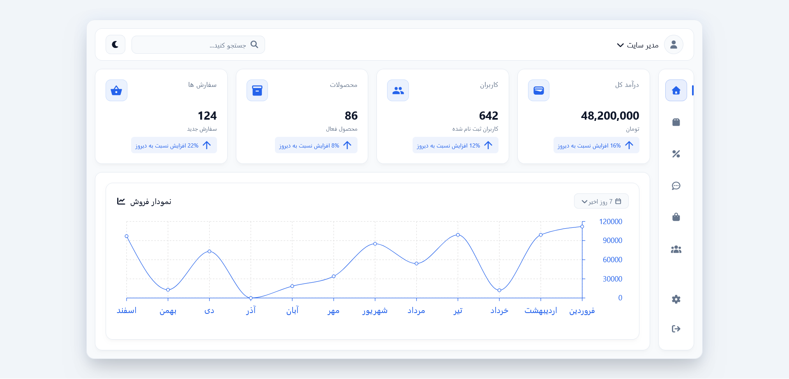
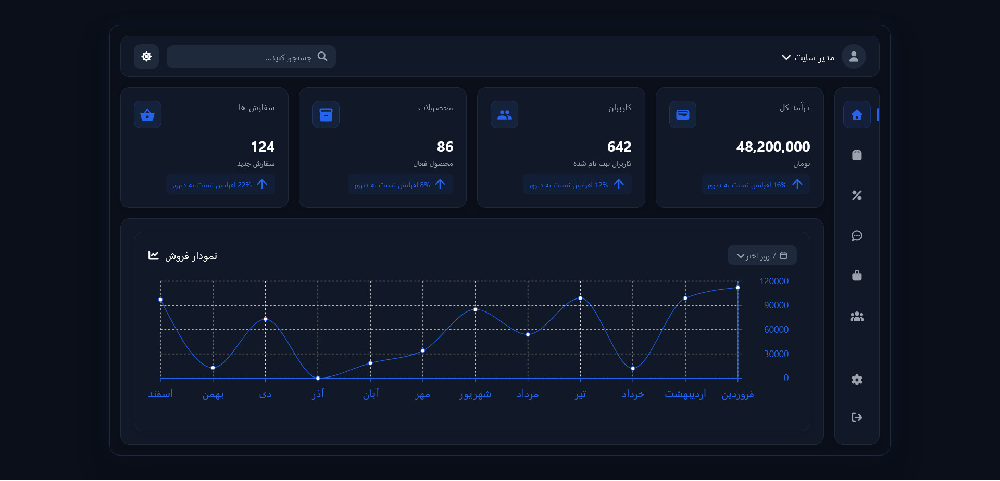
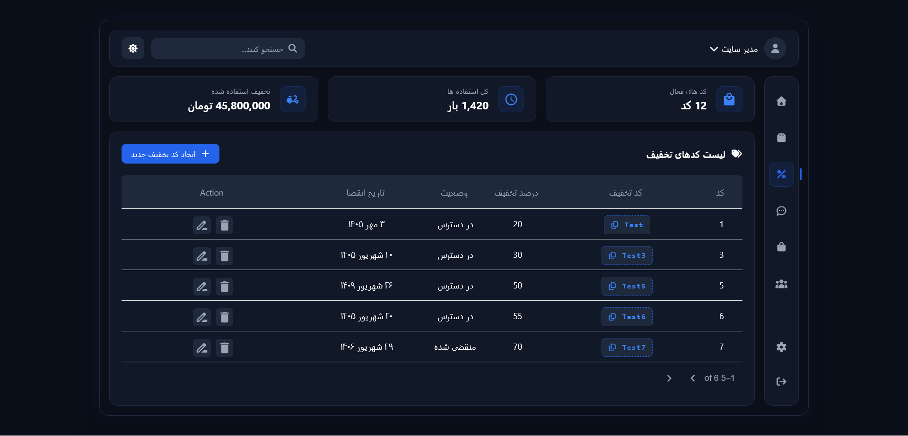
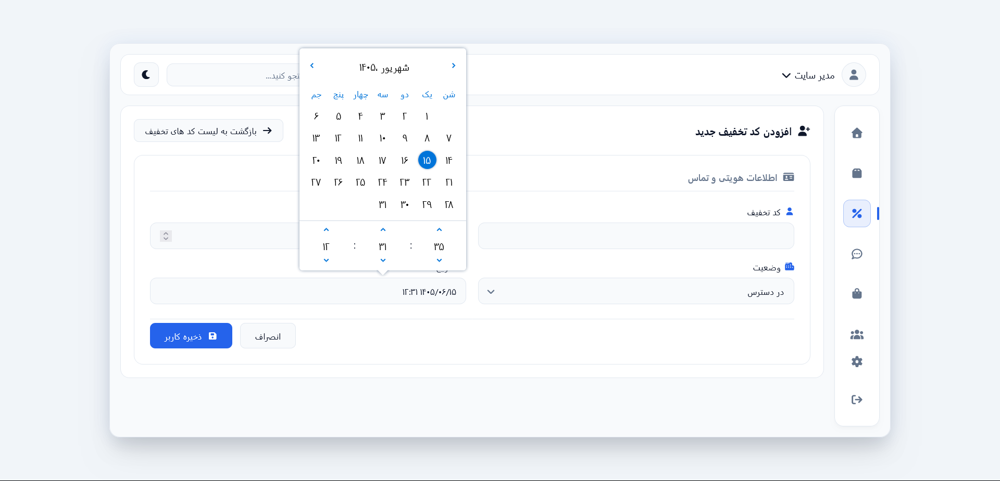
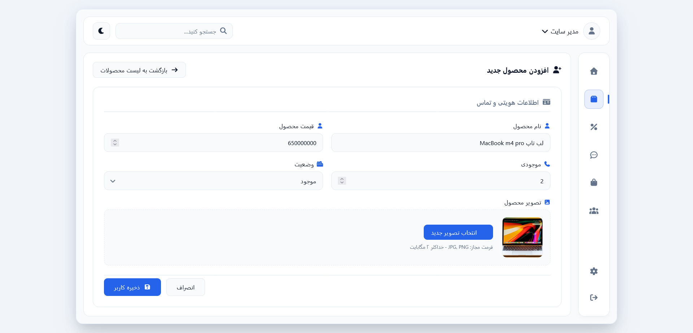

# 🛍️ E-Commerce Admin Panel

A full-stack admin panel for online stores, built with **React** on the frontend and **Django REST Framework** on the backend. It lets you manage products, orders, discount coupons, users, and comments, with full Dark/Light theme support.

<div align="center">

     
</div>

---

## 📋 Table of Contents

- [Preview](#-preview)
- [Features](#-features)
- [Tech Stack & Versions](#-tech-stack--versions)
- [Packages Used](#-packages-used)
- [Project Structure](#-project-structure)
- [Installation & Setup](#-installation--setup)
- [API Documentation](#-api-documentation)
- [Roadmap](#-roadmap)
- [License](#-license)

---

## 🖼️ Preview

### Main Dashboard (Light & Dark theme)

<p align="center">
  
  
</p>

### Coupon Management

<p align="center">
  
</p>

<p align="center">
  
</p>

### Add/Edit Product

<p align="center">
  
</p>

---

## ✨ Features

- Analytics dashboard with a sales chart, order count, product count, users, and total revenue
- Full product management (add, edit, delete, image upload, stock and price)
- Coupon management with discount percentage, expiration date (Jalali/Persian calendar), and status
- Order management
- User management
- Product comment management
- Dark/Light theme support
- Fully RTL and Persian-localized UI
- Auto-generated API docs (Swagger/Redoc) via drf-spectacular

---

## 🧰 Tech Stack & Versions

| Layer    | Technology            | Version               |
| -------- | --------------------- | --------------------- |
| Frontend | React                 | ^19.2.8               |
| Frontend | Node.js (recommended) | ≥ 18.x                |
| Backend  | Python                | 3.12+                 |
| Backend  | Django                | 6.1.1                 |
| Backend  | Django REST Framework | 3.18.0                |
| Database | SQLite3               | (development default) |

> Your Python version should be 3.12 or higher, since Django 6.1 requires it as a minimum.

---

## 📦 Packages Used

### Frontend (`Frontend/cms-app/package.json`)

| Package                       | Version  |
| ----------------------------- | -------- |
| react                         | ^19.2.8  |
| react-router-dom              | ^7.18.3  |
| @mui/x-data-grid              | ^9.13.0  |
| @mui/icons-material           | ^9.4.0   |
| @emotion/react                | ^11.14.0 |
| @emotion/styled               | ^11.14.1 |
| @fortawesome/fontawesome-free | ^7.3.1   |
| react-multi-date-picker       | ^4.5.2   |
| recharts                      | ^3.10.1  |


### Backend (`Backend/requirements.txt`)

| Package                   | Version  |
| ------------------------- | -------- |
| Django                    | 6.1.1    |
| djangorestframework       | 3.18.0   |
| django-cors-headers       | 4.9.0    |
| drf-spectacular           | 0.30.0   |
| pillow                    | 12.3.0   |
| jsonschema                | 4.26.0   |
| jsonschema-specifications | 2025.9.1 |
 
---

## 🗂️ Project Structure

```
ecommerce-admin-panel/
├── Backend/                  # Django project (API)
│   ├── core/                 # Core project settings, urls
│   ├── products/             # Products, coupons, and comments app
│   ├── orders/                # Orders app
│   ├── users/                # Users app
│   ├── manage.py
│   └── requirements.txt
│
└── Frontend/
    └── cms-app/               # React application
        ├── src/
        │   ├── Components/    # Shared components (Header, Sidebar, Table, Chart, ...)
        │   ├── Context/       # ThemeContext for Dark/Light theme management
        │   ├── pages/         # Pages (Home, Product, Coupon, Order, User, Comment, ...)
        │   ├── data/          # Sample/mock data
        │   └── routes.js      # Application routes
        └── package.json
```

---

## ⚙️ Installation & Setup

### Prerequisites

- Node.js 18+ and npm
- Python 3.12+

### 1. Clone the repository

```bash
git clone https://github.com/Ali-Arezoomandi/ecommerce-admin-panel.git
cd ecommerce-admin-panel
```

### 2. Set up the backend (Django)

```bash
cd Backend

# Create a virtual environment
python -m venv venv
source venv/bin/activate     # Windows: venv\Scripts\activate

# Install dependencies
pip install -r requirements.txt

# Run migrations
python manage.py migrate

# Create an admin user (optional)
python manage.py createsuperuser

# Run the server
python manage.py runserver
```

The backend server will be available at `http://127.0.0.1:8000`.

### 3. Set up the frontend (React)

```bash
cd Frontend/cms-app

# Install dependencies
npm install

# Run the project
npm start
```

The frontend will be available at `http://localhost:3000` (the backend's default CORS settings already allow this origin).

---

## 📚 API Documentation

The backend auto-generates API documentation via `drf-spectacular`:

- Swagger UI: `http://127.0.0.1:8000/api/docs/`
- Redoc: `http://127.0.0.1:8000/api/redoc/`
- OpenAPI Schema: `http://127.0.0.1:8000/api/schema/`

### Main API Endpoints

| Method         | Endpoint                     | Description                           |
| -------------- | ---------------------------- | ------------------------------------- |
| GET/POST       | `/api/products/`             | List and create products              |
| GET/PUT/DELETE | `/api/products/<id>`         | Retrieve, update, or delete a product |
| GET/POST       | `/api/products/coupon`       | List and create coupons               |
| GET/PUT/DELETE | `/api/products/coupon/<id>`  | Retrieve, update, or delete a coupon  |
| GET/POST       | `/api/products/comment`      | List and create comments              |
| GET/PUT/DELETE | `/api/products/comment/<id>` | Retrieve, update, or delete a comment |
| GET/POST       | `/api/orders/`               | List and create orders                |
| GET/PUT/DELETE | `/api/orders/<id>`           | Retrieve, update, or delete an order  |
| GET/POST       | `/api/users/`                | List and create users                 |
| GET/PUT/DELETE | `/api/users/<id>`            | Retrieve, update, or delete a user    |

---

## 🗺️ Roadmap

- [ ] Add JWT authentication
- [ ] Fully connect frontend pages to the real API instead of sample data
- [ ] Add automated tests for backend and frontend
- [ ] Dockerize the project

---

## 📄 License

This project is open source and available for learning purposes.

---

<div align="center">

Built by [Ali Arezoomandi](https://github.com/Ali-Arezoomandi)

</div>
